# <div align="center">

<br/>

# 𝗥𝗲𝗹𝗮𝘁𝗿𝗶𝘅

**A personal knowledge‑management and visual‑notes platform for deep thinkers.**

*Stop collecting. Start visualising.*

<br/>

[](https://developer.android.com)
[](https://kotlinlang.org/docs/multiplatform.html)
[](https://developer.android.com/compose)
[](https://github.com/cashapp/sqldelight)
[](/)
[](/)

<br/>

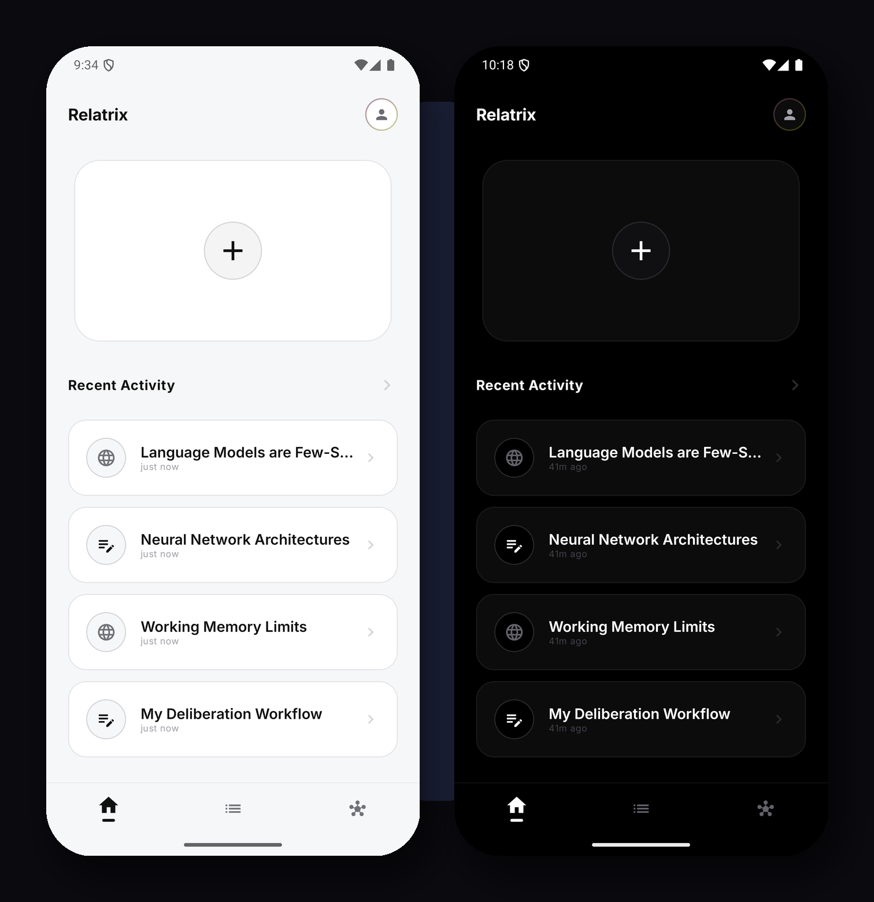

<br/>

---

## The Problem

Most knowledge‑management tools are glorified bookmarks. You gather articles, highlight text, save links — and then forget everything.

**Relatrix** changes that. Built on a single, uncompromising philosophy:

> **You do not truly understand something until you visualise it as a note or a graph.**

Every resource you save must be accompanied by a **Vision** – a visual note (sketch, diagram, or annotated screenshot) – before it enters your library. Deliberate visualisation is mandatory, not optional.

---

## ✨ Feature Overview

<br/>

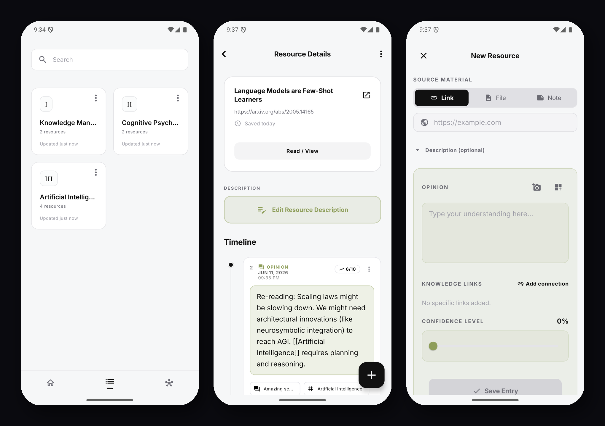

<br/>

### 📚 Topic Library
Organise your intellectual world into **Topics** – curated folders of resources. Each topic has an overview, holds web links, PDFs, and markdown notes, and surfaces all connected resources at a glance. Full‑text offline search across everything.

### 🗂 Resource Timeline
Every resource lives in a rich **Timeline** view: a single chronological feed that unifies your Opinions, Annotations, Bookmarks, and now **Vision** images. Watch your thinking evolve from first impression to deep mastery.

### ✍️ Vision‑First Entry
**Vision** is a visual note attached to any resource. When you save a PDF, a web page, or a markdown note, you must capture or create a visual representation – a screenshot, sketch, diagram, or highlighted excerpt. This forces deliberate visual thinking.

### 🔗 Knowledge Links
While writing an opinion or a vision, reference any other resource, topic, or insight using `[[double‑bracket]]` wiki‑style links. These cross‑references form a bidirectional backlink graph — the raw data for Relatrix.

---

## 📖 PDF Reader – Visual‑Note‑Ready

The built‑in PDF reader lets you **read, annotate, and capture visual notes** in one place. You can:
- Flip pages with smooth gestures.
- Highlight passages and instantly turn them into **Vision** snapshots.
- Add confidence scores and tags to each annotated excerpt.
- Export annotations as markdown or plain‑text.

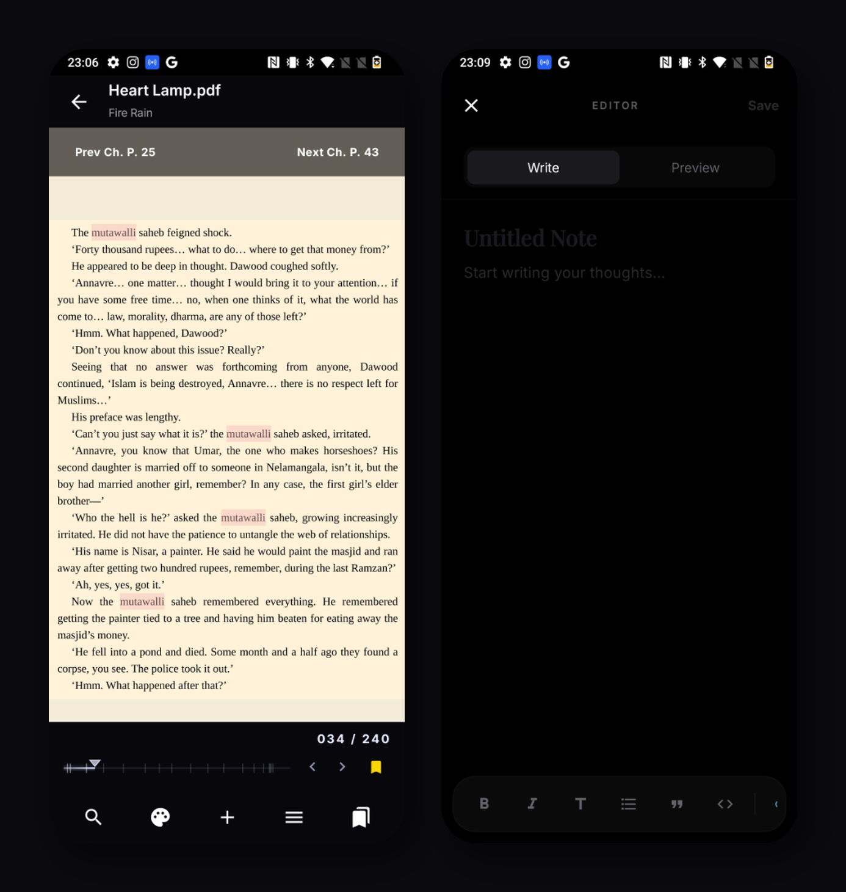

The composite above shows the PDF reader on the left and the note editor on the right, both in dark mode, demonstrating how you can seamlessly transition from reading to visual note‑taking.

---

## 🖊️ Note Editor – Visual‑Note‑Focused

The note editor is a minimalist markdown canvas with a **visual‑note sidebar** that displays attached images, sketches, or screenshots. Features include:
- Real‑time markdown preview.
- Drag‑and‑drop of Vision images.
- Quick formatting toolbar (bold, italics, headings, lists, code).
- Export to PDF, Markdown, or plain‑text.

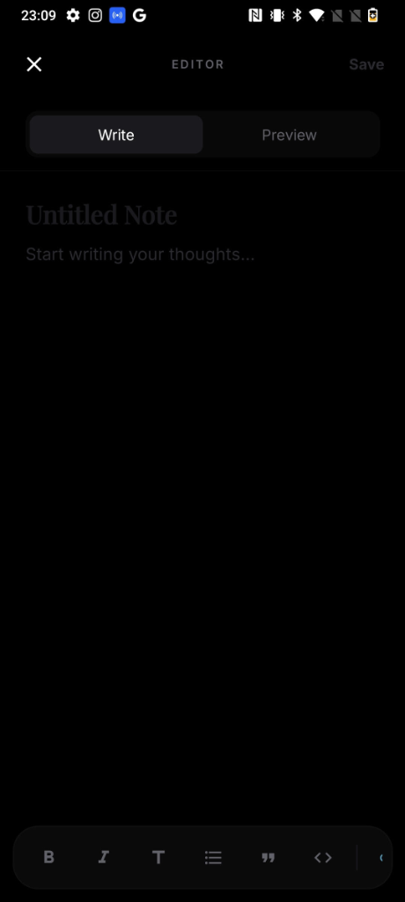

---

## 🕸 Relatrix — Your 3D Knowledge Graph

<br/>

<p align="center">
  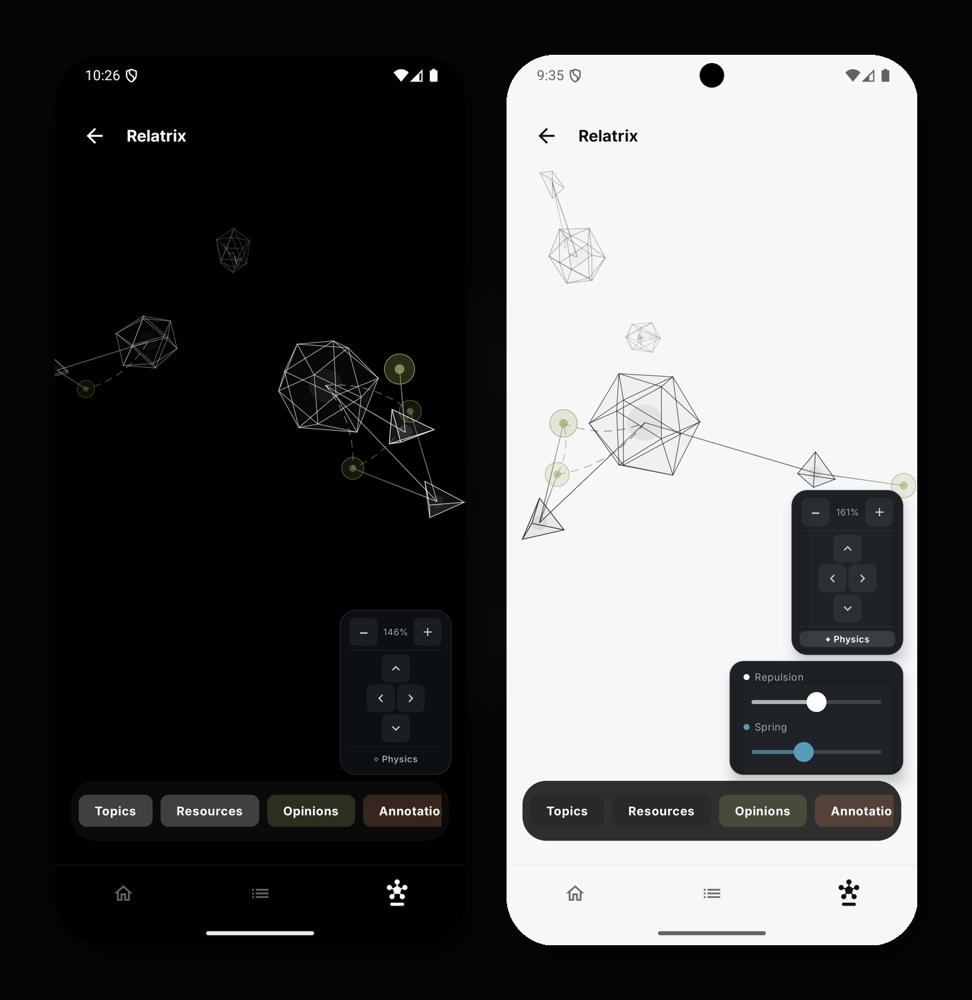
  
</p>

<br/>

Relatrix is a live, physics‑simulated 3D graph that renders the connective tissue of your knowledge base. Every node is a resource or topic; every edge is a knowledge link you created. Filter by **Topics, Resources, Opinions, or Vision**. Pinch to zoom, drag to rotate, adjust the physics engine (repulsion, spring tension) in real time.

Patterns that would take hours to discover in a flat list become visually obvious in seconds.

---

## 🌙 Light & Dark Mode

<br/>

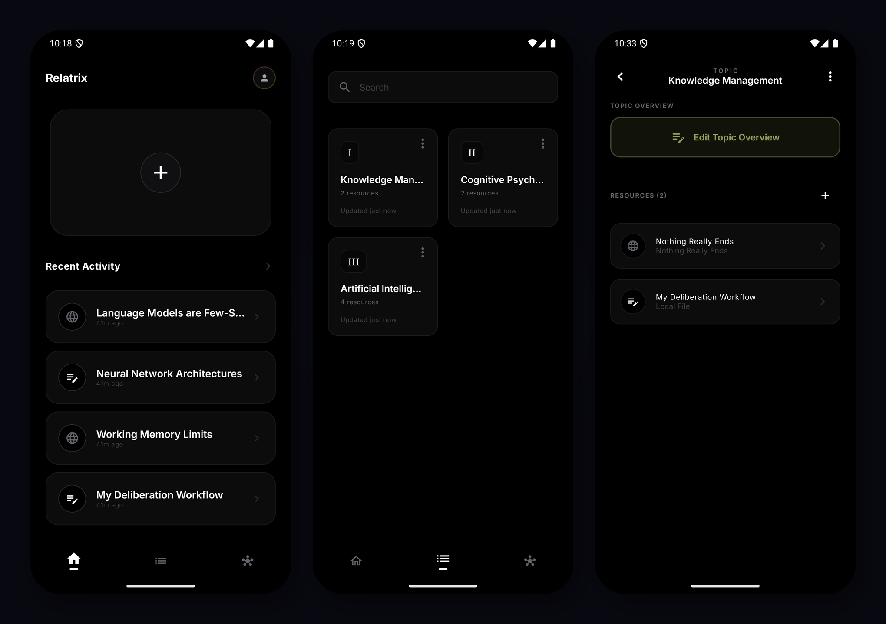

<br/>

A first‑class dark mode built into the design system from the start — not retrofitted. Every screen, every component adapts cleanly.

---

## 🏗 Architecture

Relatrix is built for long‑term stability. The codebase uses **Kotlin Multiplatform** so that the core business logic is shared across Android and (upcoming) iOS, with zero duplication.

```
Relatrix/
├── shared/                     # Platform‑agnostic core
│   ├── domain/                 # Entities: Topic, ResourceEntry, Vision, Opinion, Annotation
│   ├── data/                   # SQLDelight repositories, encrypted with SQLCipher
│   └── business/               # LocalSearchEngine, RelatrixGraph, ExportService
│
└── androidApp/                 # Native Android client
    ├── ui/                     # Jetpack Compose screens & components
    ├── viewmodel/              # MVVM — RelatrixViewModel, DraftingViewModel
    ├── di/                     # Koin dependency injection modules
    └── workers/                # WorkManager background cleanup tasks
```

### Tech Stack

| Layer | Technology |
|:---|:---|
| Language | Kotlin Multiplatform |
| Android UI | Jetpack Compose |
| iOS UI | SwiftUI *(in development)* |
| Database | SQLDelight + SQLCipher (encrypted) |
| Concurrency | Kotlin Coroutines & Flow |
| Dependency Injection | Koin |
| Background Work | WorkManager |
| PDF Rendering | Custom paged renderer with precise text selection |

---

## 🚀 Getting Started

### Prerequisites

- **Android Studio** Ladybug or later
- **JDK 17+**
- Android SDK (API 26+)

### Installation

```bash
# 1. Clone the repo
git clone https://github.com/saad-ibra/relatrix.git
cd relatrix

# 2. Open in Android Studio
# File → Open → select the cloned folder

# 3. Sync Gradle & run
# Select the 'androidApp' configuration and press Run
```

> The database is encrypted with SQLCipher and fully offline — no backend, no account, no tracking.

---

## 📋 Core Concepts

| Concept | Description |
|:---|:---|
| **Topic** | A named folder grouping related resources. Has its own overview note. |
| **Resource Entry** | Any piece of content: a Web Link, PDF file, or Markdown note. |
| **Vision** | A visual note (screenshot, sketch, diagram) attached to a resource. Mandatory for entry. |
| **Opinion** | A timestamped personal reflection on a resource, with a confidence score. |
| **Annotation** | A highlight or inline note anchored to a specific passage. |
| **Bookmark** | A milestone in your reading journey, with attached thoughts. |
| **Template** | A structured framework (e.g. "Scientific Review") that guides a new opinion. |
| **Knowledge Link** | A `[[wiki-link]]` inside an opinion or vision that creates a bidirectional edge in Relatrix. |

---

## 🗺 Roadmap

- [x] Vision‑First resource entry with confidence scoring
- [x] Unified Timeline (Opinions + Annotations + Bookmarks + Vision)
- [x] Relatrix 3D knowledge graph with physics simulation
- [x] SQLCipher‑encrypted offline database
- [x] Full‑text offline search
- [x] PDF reader with visual‑note capture
- [x] Dark mode
- [ ] iOS app (SwiftUI) — *in development*
- [ ] iCloud / local sync between devices
- [ ] AI‑assisted reflection prompts *(planned)*
- [ ] Web clipper browser extension *(planned)*

---

## 📸 All Screens

<details>
<summary>Expand to view all screenshots</summary>

<br/>

| Screen | Light | Dark |
|:---|:---:|:---:|
| Home | 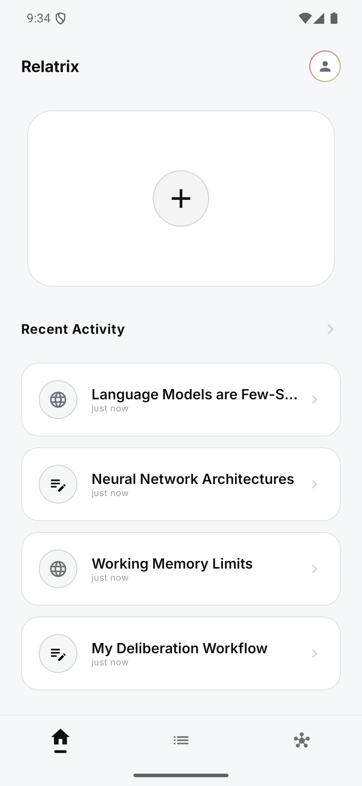 | 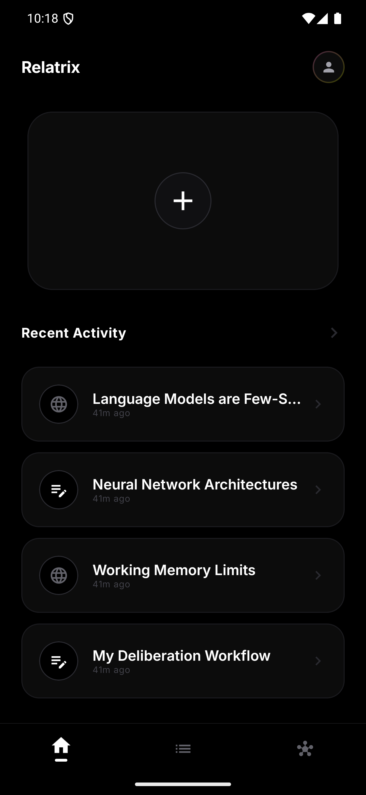 |
| Library | 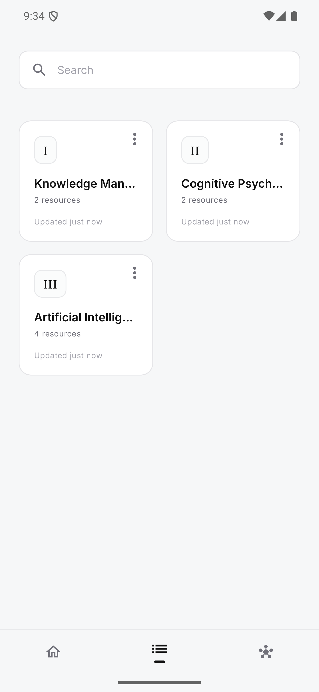 | 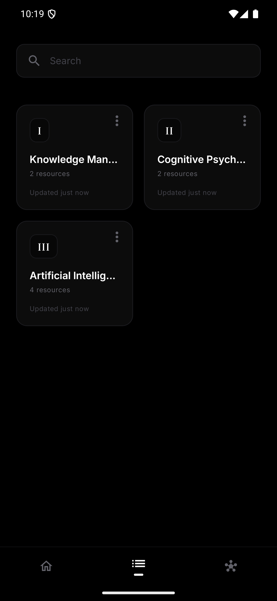 |
| Relatrix | 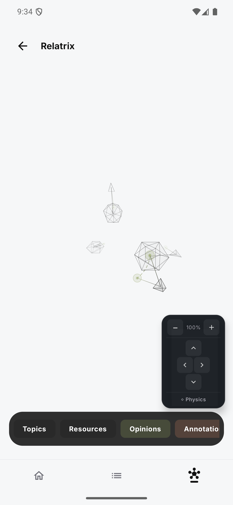 | 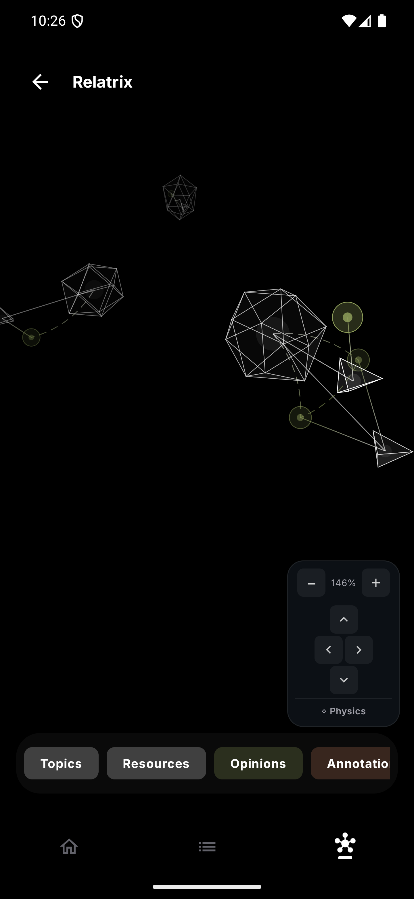 |
| Resource Detail | 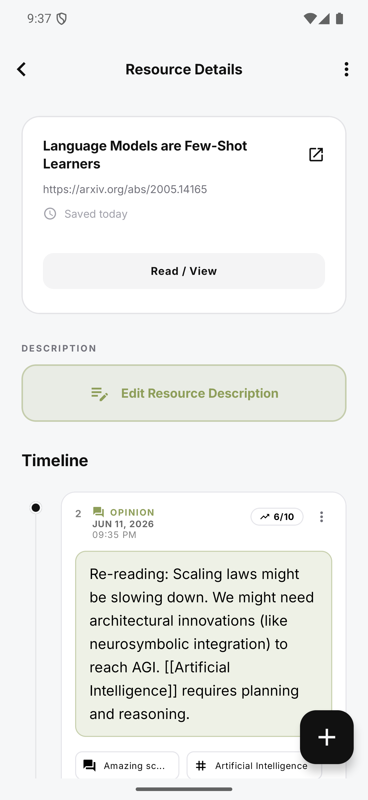 |  |
| New Entry | 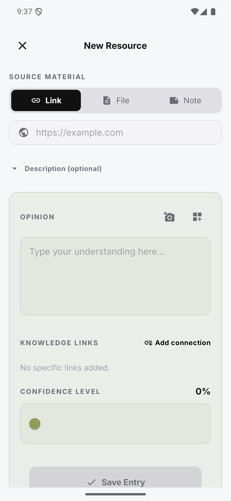 | — |
| Topic Detail | 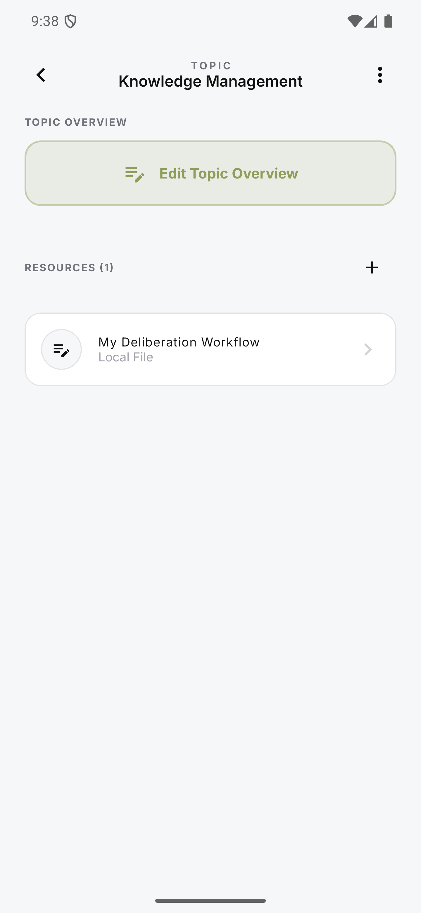 | 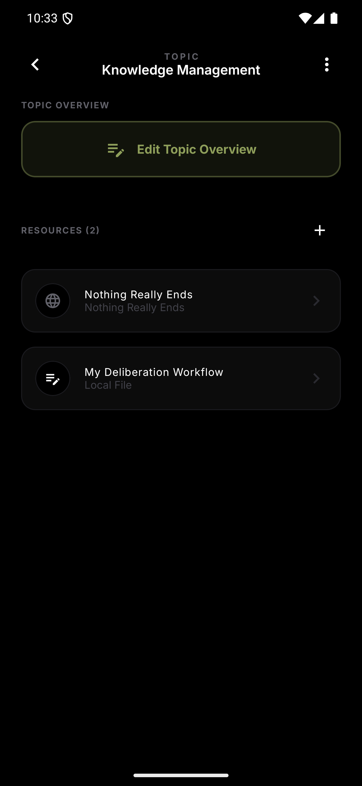 |
| Profile & Settings | 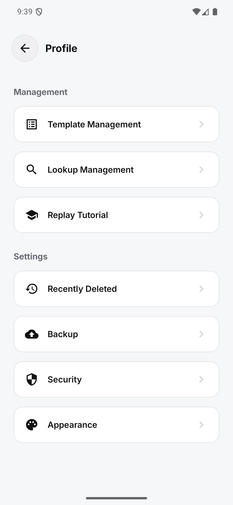 |  |
| PDF Reader | 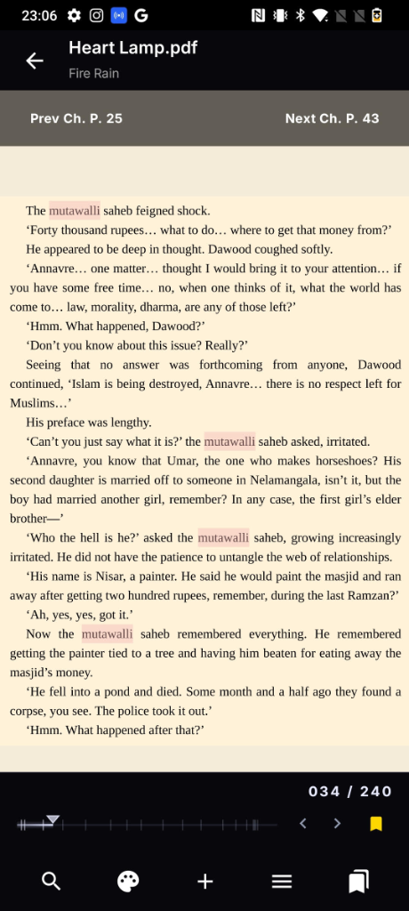 |  |
| Note Editor |  | — |
</details>

---

<div align="center">

Built with sleepless nights, infinite caffeine, and deliberate thinking.

*For researchers, deep readers, students, and anyone who actually wants to understand what they consume.*

</div>
